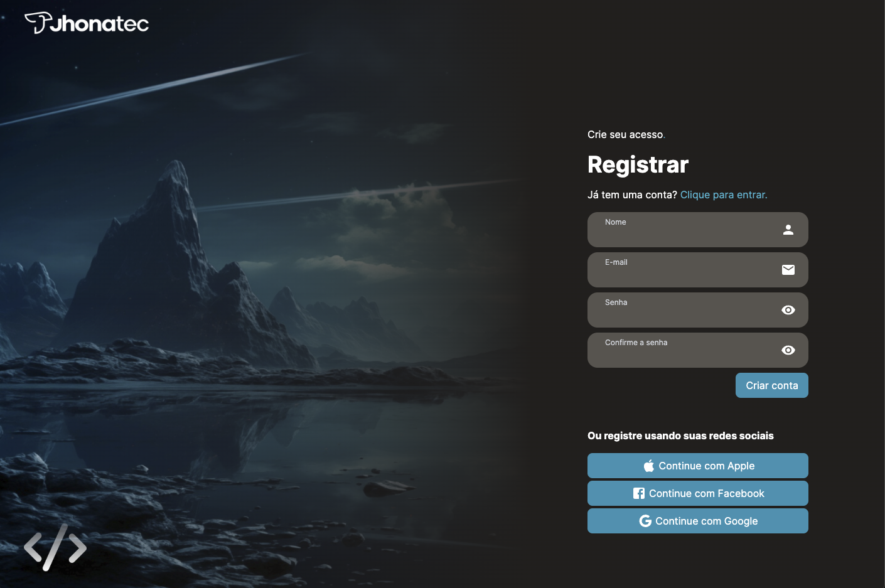

# Desafio Front End NextJS/TailWindCSS

> FrontEnd Challenge to build a Login/Register page with NextJS

O desafio é construir uma página de Login com elementos essenciais e uma página para registrar-se.

### Rotas

- [ / ]: página de Login
- [ /register ]: página de Cadastro
- [ /home ]: página acessado caso o Login seja bem-sucedido
- [ /demais-rotas ]: página 404 personalizada

> A aplicação está registrando o usuário no LocalStorage, então, crie um cadastro válido para testar :-D
> Caso os dados no cadastro/login sejam inválidos, a aplicação informará de forma interativa

### Techs utilizadas

- NextJS v14.2.1
- TailWindCSS
- React-Hook-Forms (valida os campos dos formulários e promove interatividade com estados)
- Validator (para o formato de email@mail.com)
- Sharp (otimizador do NextJS para imagens)

### Como executar

1. Clone o repositório rodando

```bash
git clone git@github.com:jhonatec-dev/desafio-vitor-nogueira.git
```

2. Dentro da pasta do projeto (`desafio-vitor-nogueira`), execute:

```bash
npm install
```

3. Agora é só colocar o servidor em execução:

```bash
npm run dev
```

4. Acessa na sua máquina [Clicando aqui](http://localhost:3000 "LocalHost:3000")
    - Em outras máquina da sua rede local usando http://(seu IP):3000
    - Exemplo: http://192.168.1.25:3000

## Deploy
O site já está em ambiente de produção! Basta [Clicar aqui](https://desafio.jhonatec.dev "Desafio Jhonatec")

### Print



